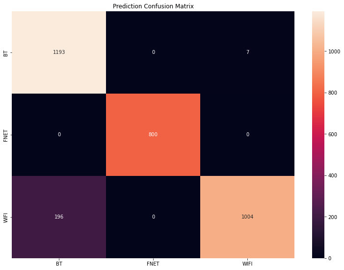
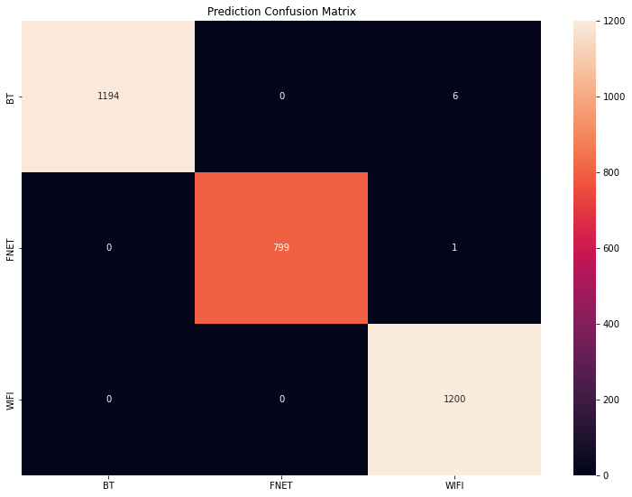

# Activation functions and effects on accuracy

> This document contains the observations on the differences in accuracy of the resnet model when different activation functions are used for the fully-conncected Dense layers.

When performing open-set classification using the orignal resnet model, it was noted that there was quite a significant overfit of `WIFI` records, despite the fact that the model structure was not significantly modified in any way. It turned out that having different activation functions in the classifier portion of the model was enough to significantly alter how well the model performs, a change made in an attempt to get the model working on an Edge TPU that was not initially caught. Below are a few examples.

> As seen, the model appears to siginificantly overfit `WIFI` records as `BT` instead when using `ReLU` as its activation function.

When using the `ReLU` activation function on all of the `Dense` layers in the classifier, the model misclassifies 196 of 1200 `WIFI` records as `BT` instead, a full 16% of all validation records for `WIFI`. It also misclassified 7 of 1200 `BT` records as `WIFI`.

> As seen, there is a big improvement in accuracy when using `SELU` activation compared to `ReLU`.

When the model was reverted back to using `SELU` in its Dense classification layers, it performed a lot better as expected. It had 100% accuracy for `WIFI` validation records, and only misclassified 6 of 1200 `BT` records as `WIFI`. Interestingly, a single `FNET` validation record was misclassified as `WIFI`, despite not having done so with `ReLU` activation.
