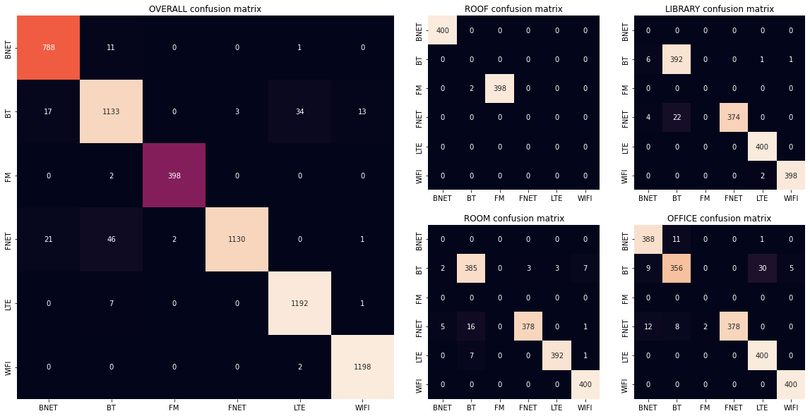
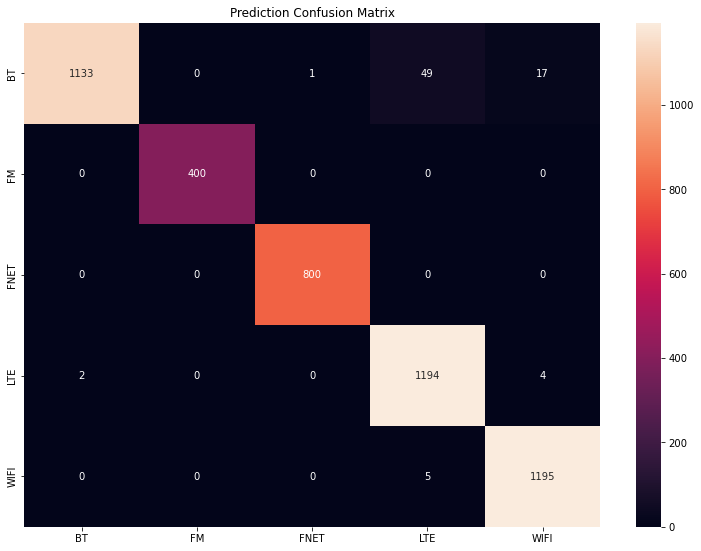
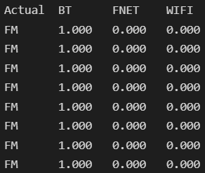
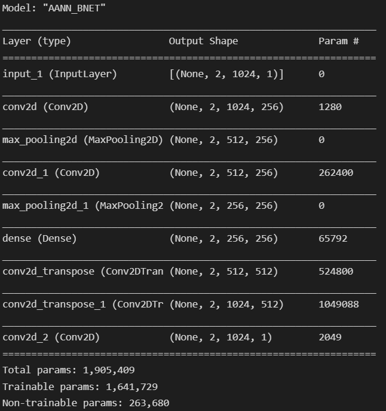
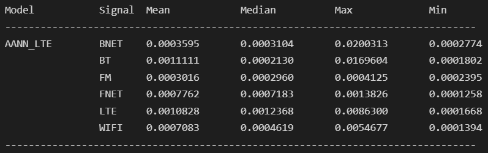
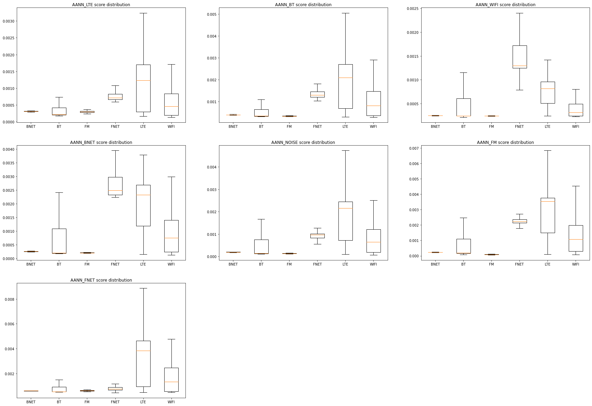
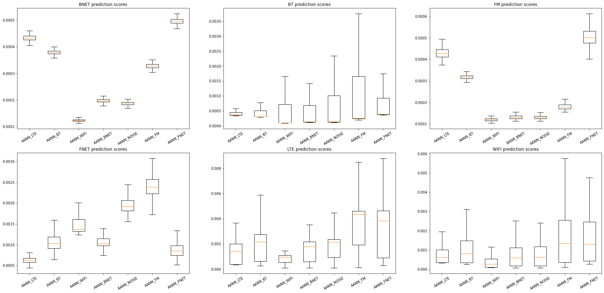

# **The** Report

Done by: `Ang Yak Hng, Koh Heng Woon`
> **Disclaimer**: this document assumes proficiency/familiarity with terms in the Anaconda data science python framework and Tensorflow.

## Table of Contents

- [**The** Report](#the-report)
  - [Table of Contents](#table-of-contents)
  - [Literature Review](#literature-review)
    - [Existing :sparkle:_Literature_:sparkle: of Signal Classification](#existing-sparkleliteraturesparkle-of-signal-classification)
    - [Open Set](#open-set)
  - [The Radio Part](#the-radio-part)
    - [Signals](#signals)
      - [_Digitally Generated Signals_](#digitally-generated-signals)
      - [_Live Signals_](#live-signals)
    - [A visual on the data](#a-visual-on-the-data)
  - [AI Models](#ai-models)
    - [Standard AI Classification](#standard-ai-classification)
      - [_Data Importing and Processing_](#data-importing-and-processing)
      - [_Model Evaluation Notebook_](#model-evaluation-notebook)
      - [_ResNet using SA data_](#resnet-using-sa-data)
      - [_Other models using SA data_](#other-models-using-sa-data)
    - [Open-set AI Classification](#open-set-ai-classification)
      - [_ResNet with omitted SA data_](#resnet-with-omitted-sa-data)
      - [_Open-set ResNet with SA data_](#open-set-resnet-with-sa-data)
      - [_Open-set ResNet with omitted SA Data_](#open-set-resnet-with-omitted-sa-data)
      - [_Open-set AANN with SA Data_](#open-set-aann-with-sa-data)
  - [The Application](#the-application)
    - [How to use](#how-to-use)
    - [Architecture](#architecture)
      - [POC](#poc)
    - [Using SDRs](#using-sdrs)
    - [GUI](#gui)
      - [_Web Version_](#web-version)
      - [_PyQt_](#pyqt)
  - [Links, sinks, and other hijinks](#links-sinks-and-other-hijinks)
  - [Future Work??](#future-work)

## Literature Review

_Files of Interest: `resnet.ipynb` | `deep_resnet.ipynb` | `hybrid_conv_imgen.ipynb` | `hybrid_conv.ipynb` | `inception_resnet.ipynb`_
> Explained/Referenced in following subsections

### Existing :sparkle:_Literature_:sparkle: of Signal Classification

We started off by looking up papers pertaining to our AI problem, and came across quite a few along the way. Due to the importance of being able to know what RF signals are being transmitted in the air, it was relatively easy to find papers exploring the topics we were interested in. We also attempted to implement the methodologies used in some of the papers that we deemed interesting and could be converted to our use case.

- `inception_resnet.ipynb` - Automatic Modulation Classification Based on Deep Learning for Software-Defined Radio: <https://www.hindawi.com/journals/mpe/2020/2678310/>
- `deep_resnet.ipynb` - Fusion Methods for CNN-Based Automatic Modulation Classification: <https://ieeexplore.ieee.org/stamp/stamp.jsp?tp=&arnumber=8720067>
- `hybrid_conv_imgen.ipynb` | `hybrid_conv.ipynb` - Deep Learning Radio Frequency Signal Classification with Hybrid Images: <https://arxiv.org/pdf/2105.09063.pdf>
- `resnet.ipynb` - Over the Air Deep Learning Based Radio Signal Classification: <https://arxiv.org/pdf/1712.04578.pdf>

### Open Set

Later into the project, we were tasked with getting our model to detect unknown signal types, so we started researching open-set classification.

- [https://github.com/iCGY96/awesome_OpenSetRecognition_list#challenges](https://github.com/iCGY96/awesome_OpenSetRecognition_list#challenges)
- [[2108.01656] Open Set Wireless Standard Classification Using Convolutional Neural Networks (arxiv.org)](https://arxiv.org/abs/2108.01656)
  - [[1709.08716] DOC: Deep Open Classification of Text Documents (arxiv.org)](https://arxiv.org/abs/1709.08716)
- [https://arxiv.org/pdf/2002.07777.pdf](https://arxiv.org/pdf/2002.07777.pdf)

- [https://ietresearch.onlinelibrary.wiley.com/doi/10.1049/el.2019.3586](https://ietresearch.onlinelibrary.wiley.com/doi/10.1049/el.2019.3586)
- [https://www.sciencedirect.com/science/article/abs/pii/S1568494616300795](https://www.sciencedirect.com/science/article/abs/pii/S1568494616300795)
- [https://www.hindawi.com/journals/mpe/2020/9797302/](https://www.hindawi.com/journals/mpe/2020/9797302/)

- [https://www.hindawi.com/journals/mpe/2020/2678310/](https://www.hindawi.com/journals/mpe/2020/2678310/)
- [https://www.researchgate.net/publication/339114799_Automatic_Modulation_Classification_Using_a_Deep_Multi-Stream_Neural_Network](https://www.researchgate.net/publication/339114799_Automatic_Modulation_Classification_Using_a_Deep_Multi-Stream_Neural_Network)
- [https://asp-eurasipjournals.springeropen.com/track/pdf/10.1186/s13634-019-0616-6.pdf](https://asp-eurasipjournals.springeropen.com/track/pdf/10.1186/s13634-019-0616-6.pdf)
- [https://www.hindawi.com/journals/mpe/2020/2678310/](https://www.hindawi.com/journals/mpe/2020/2678310/)
- [https://books.google.com.sg/books?hl=en&lr=&id=AZtUDwAAQBAJ&oi=fnd&pg=PR11&dq=+Automatic+modulation+classification:+principles,+algorithms+and+applications&ots=ZdTXnXTLlZ&sig=HFUaYX2Kq76pFWakrqBiYO4PVRA&redir_esc=y#v=onepage&q=Automatic modulation classification%3A principles%2C algorithms and applications&f=false](https://books.google.com.sg/books?hl=en&lr=&id=AZtUDwAAQBAJ&oi=fnd&pg=PR11&dq=+Automatic+modulation+classification:+principles,+algorithms+and+applications&ots=ZdTXnXTLlZ&sig=HFUaYX2Kq76pFWakrqBiYO4PVRA&redir_esc=y#v=onepage&q=Automatic%20modulation%20classification%3A%20principles%2C%20algorithms%20and%20applications&f=false)
- [https://ietresearch.onlinelibrary.wiley.com/doi/10.1049/el.2019.3586](https://ietresearch.onlinelibrary.wiley.com/doi/10.1049/el.2019.3586)

- [https://ieeexplore.ieee.org/abstract/document/8436654](https://ieeexplore.ieee.org/abstract/document/8436654)
- [https://ieeexplore.ieee.org/abstract/document/1380405](https://ieeexplore.ieee.org/abstract/document/1380405)
- [https://ieeexplore.ieee.org/document/8454504](https://ieeexplore.ieee.org/document/8454504)
- [https://ieeexplore.ieee.org/document/8643794](https://ieeexplore.ieee.org/document/8643794)
- [https://ieeexplore.ieee.org/abstract/document/6487244](https://ieeexplore.ieee.org/abstract/document/6487244)
- [https://ieeexplore.ieee.org/abstract/document/9037117](https://ieeexplore.ieee.org/abstract/document/9037117)
- [https://ieeexplore.ieee.org/document/9149077](https://ieeexplore.ieee.org/document/9149077)
- [https://ieeexplore.ieee.org/abstract/document/7920746](https://ieeexplore.ieee.org/abstract/document/7920746)
- [https://ieeexplore.ieee.org/abstract/document/9445234](https://ieeexplore.ieee.org/abstract/document/9445234)

## The Radio Part

### Signals

> Did we need to learn signal processing techniques?
>
> Short answer: No but we read up on it a bit at the start of the project anyways and it was cool.

The project had 2 distinct phases in terms of signals that were trained. The first used clean digitally generated signals from the DeepSig dataset. The second from live signals collected from various sources in urban environments.

#### _Digitally Generated Signals_

These signals [DeepSig](https://www.deepsig.ai/datasets) were digitally sent and collected using SDR's, allowing for completely clean signals without any additional noise that could interfere with the training of the model.

DeepSig sorted their frequencies by modulation type. These were:

- 8PSK
- AM-DSB
- AM-SSB
- BPSK
- CPFSK
- GFSK
- PAM4
- QAM16
- QAM64
- QPSK
- WBFM

#### _Live Signals_

Phase 2 had us collect actual signals live using the Tektronix RSA RSA507A Spectrum Analyzer (SA). SignalVu-PC was used to interface with the spectrum analyzer to export the data.

With Singapore being an urban environment, it's not possible to collect entirely clean signals without a faraday cage setup. However if reasonable results could be obtained from noisy signal data, it would make a real-world application more feasable. For extra measure however, noise reduction can be easily automated using Matlab's signal processing library.  

| Signal name/Radio model                       |      Center Freq      | Sampled Freq Range | Modulation Type |                     Locations |
| :-------------------------------------------- | :-------------------: | :----------------: | :-------------: | ----------------------------: |
| Bluethooth                                    |       2.44 Ghz        |       40Mhz        |      GFSK       | Office, Meeting Room, Library |
| Wifi (5Ghz)                                   |      5.55000 Ghz      |       20 Mhz       |       QAM       |
| LTE (Uplink)                                  |       1.775 GHz       |       20 MHz       |    QAM/QPSK     |
| Radio Stations                                | 98.7 MHz 100.3 MHz |       5 MHz        |       FM        |
| Thales Manpack Fixed Frequency (TMFF) (Voice) |   80 MHz 40 MHz    |       1 MHz        |       FM        |
| BNET                                          |        290MHz         |       10 MHz       |

Collected Signal Properties

Signals were collected in more than one location to have data on different noise environments (thought this is not the most comprehensive)e In DSTA, Level 2 and 12 have different benefits for signal collection. Level 12 is ideal but we occasionally encountered transmissions on certain frequencies asides from the ones we were expecting (70Mhz had an occasional transmission when we were collecting Thales and it definitely was not a radio station.) To avoid this, Level 2 meeting rooms were less likely but it had more reflection being that it was a closed indoor room.

### A visual on the data

## AI Models

_Files of Interest: `SA_data_import.ipynb` | `SA_resnet.ipynb` | `SA_resnet_unknown.ipynb` | `model_eval.ipynb` | `SA_inception_resnet.ipynb` | `SA_openres.ipynb`_
> These will be referenced in subsections below.

### Standard AI Classification

Once we had collected all of the data needed using the SA, we moved on to training of a model for the classification. There were many models that we could use, but we decided to make use of the _ResNet_ model experimented on during the literature review as part of the `resnet.ipynb` file, as it was trained on data in the same format as our collected data while still providing accurate results, with less data pre-processing needed like in `hybrid_conv.ipynb`, which required the data to be processed into images before use. It also used records that were only 1/4 the length of our own collected data, so we thought that by increasing the length of our collected records, we could improve its accuracy.

#### _Data Importing and Processing_

To start, we needed to actually convert the files collected during data collection into a format that is usuable for model training, so we created `SA_data_import.ipynb` for developing the functions and algorithms needed to process the files. First, the correct files to open are found using Python's built-in `pathlib` library, then each file's included signal data is extracted, which contains the collected signal's information like sampling frequency, samples per record and total number of records collected. Next, the raw records are temporarily stored into a `pandas DataFrame` object, or `df`, which itself is stored in a list of other `df` objects of other signal files. This process is also repeated for the separate validation datasets used for verifying model performane. The lists of signal datasets are then processed, where based on the included dataset data, the IQ data is split into smaller chunks, where it is then processed into a list. Due to model limitations, it can only accept data that is exactly 1024 samples long, thus the smaller chunks of data are either padded or truncated before being processed into a list. Additional information like signal type and location of collection are added based on the original dataset's file name. This is then concatenated into a single `train_df` and `test_df` for training and validation respectively. **The process described is used for all models trained and validated using SA data.**

#### _Model Evaluation Notebook_

For the purposes of model evaluation due to the nature of our collected data, we decided to make a dedicated notebook `model_eval.ipynb` to evaluate models in greater detail. In the notebook, a detailed breakdown of the given model is generated with metrics beyond accuracy and loss, including precision, recall, and F1 score as well. Since the training and validation data was also collected in different environments, the notebook also generates a confusion matrix that shows both an overall confusion matrix, as well as confusion matrices from the different environments the data was collected in.

#### _ResNet using SA data_

This model was the first and by far the longest-used of all the models created. Its defining feature is the extensive use of _Skip Connections_, or skipcons, where a direct connection is made between a given first layer and a given third layer, skipping the second layer entirely, allowing the model to train much more effectively despite its larger size, as it is exposed to learned gradients from further down the model.

> You can refer to the exact model structure in the `SA_resnet.ipynb` notebook, cell 18 and 19.

Originally, it was trained with only 4 signal types, Bluetooth, Wifi, LTE, and FM. But, we later added 2 more, BNET and FNET, which brought the signal count up to 6.

> As seen, the model performs quite well with validation data, with only a minor overfit of FNET as Bluetooth, and Bluetooth as LTE.

The model performed well throughout the project duration, with its accuracy only dropping marginally as more data and signal types were added.

#### _Other models using SA data_

Throughout this project, we have also tested out other models with the collected data, but to little avail, as shown in the `SA_inception_resnet.ipynb` file. We tried training the models, but they would either not compile at all, costing anywhere from hours to days dedicated to debugging them, or they would not provide good performance, meaning the time spent implementing them would have gone to waste.

### Open-set AI Classification

#### _ResNet with omitted SA data_

During the development of the ResNet model, we were raised the question: _What would happen if the model was introduced to signals that it was not trained on?_ We hypothesized that the model would end up classifying the unknown signal as one of the signals it was trained on. To test this, we trained our ResNet model and omitted 2 of the 5 signal types we had collected at the time using the `SA_resnet.ipynb` notebook. After training, the model performed well with the known signal types as expected, but also exhibited our hypothesized behaviour on the unknown signals. This led us to begin research on open-set classification.

#### _Open-set ResNet with SA data_

After some research, we came across a research paper [^1] that experimented on using open-set classification to detect signals from unknown transmittors, which we thought could be adapted to our own open-set problem. Referencing the techniques used in the paper, the provided model was adapted to fit our usecase first in the `SA_openres.ipynb` notebook, where it was then trained on all 5 of the signal types we had collected at the time as a proof of concept, to see if the model was accurate in classifying the signals we provided.

> Refer to cell 17 of the `SA_openres.ipynb` notebook for model structure.

> Shown here, it is evident that the model performs very well on our dataset, with only a slight overfit of Bluetooth as LTE.

After determining that the model performs as expected, we moved on to testing its open-set classification capabilities.

#### _Open-set ResNet with omitted SA Data_

In the `SA_openres_unknown.ipynb` notebook, we trained the same model from above, this time omitting certain classes from the training to see how the model performs. We expected that the model would be able to provide a high confidence of each of the signal types it was trained on if those signals were passed to the model, while providing low confidence to signal types that it was not trained on. Like the ResNet from `SA_resnet.ipynb`, it performed well with the signal types it was trained with as expected. However when the 2 omitted classes were input to the model for testing, it was unable to properly classify it as "unknown", instead still classifying the unknown signals as one of the 3 known signals with very high confidence levels.

> As seen, the model fails to assign low confidence scores to signals it was not trained on, instead giving it a high confidence score on one of the known signal types. (Cell 26, `SA_openres_unknown.ipynb`)

#### _Open-set AANN with SA Data_

After putting openset classification on hold for a while to work on [the application](#the-application), we were referred to another paper [^2] exploring the use of Auto-Associative Neural Networks, or Autoencoders, to detect the presence of different signals. It makes use of a quirk of autoencoders, essentially models that contain a single "bottleneck" layer that compresses its information, to detect if an input is not what the model was trained on. In theory, the autoencoder would be able to reconstruct an input that it was trained on faithfully, producing a low error, whilst inputs it was not trained on will not be reproduced correctly, producing a high error.

> This image provides an example of what an autoencoder is.

Since the provided paper did not have an implementation described, we decided to try and implement it ourselves from scratch in the `AANN.ipynb` notebook. Following various guides online to construct the autoencoder, we created an autoencoder that would take in an input and try to recreate it.

> Shown is an overview of a variation of the AANN structure we came up with. (Cell 16, `AANN.ipynb`)

Due to the way this model works, multiple instances of the model was required, one for each type of signal. As such, 6 models were trained at a time whenever a change was made. A special loss function was also created to better suit the training of the model, which can be seen in cell 15 of `AANN.ipynb`, commit a8a7cf9. It was however deleted as it was deemed unnecessary and too unstable.

Since the way this model works was different from the other models mentioned so far, since it compares the output to the input and assigns a score based on that, a separate notebook `AANN_eval.ipynb` was created to evaluate the performance of the AANNs. It takes in all of the AANNs saved from training, passes the entire validation dataset through every one of them, then saves and displays the results in a few different ways.

> Shown here, the notebook calculates averages, the max and the min of each model's prediction scores.

When we started working on this technique, we hypothesized that the AANN would provide a low error score for the signal type it was trained on while giving a high error score for any other signal type, or at least a score that was distinct from other signal types so that a threshold could be established.

> As seen, almost none of the models were able to accurately predict their own signal type, with signal types that managed to get an equivalent or lower average error score in almost all of them.

> Replotting the data, it is evident that none of the signals had their corresponding models predict the lowest error scores, often with other models for other signal types doing better.

As seen above, the AANN method did not perform as we expected, with many of the models simply not able to properly differentiate between the signal type it was trained on and other signal types. A large variety of methods were tested, including modifying the model structure, changing how the error scores were calculated during training to provide better feedback to the model, making use of other methods in the process, or a combination of any and all of them. We tested more than 10 different variations of the model to little avail, all showing either marginal improvement or none at all.

## Links, sinks, and other hijinks

[^1]: Deep Learning Approaches for Open Set Wireless
Transmitter Authorization: <https://arxiv.org/pdf/2002.07777.pdf>
[^2]: Classification of Communication Signals and Detection of
Unknown Formats Using Artificial Neural Networks: <https://www.sto.nato.int/publications/STO%20Meeting%20Proceedings/RTO-MP-IST-054/MP-IST-054-P06.pdf>
