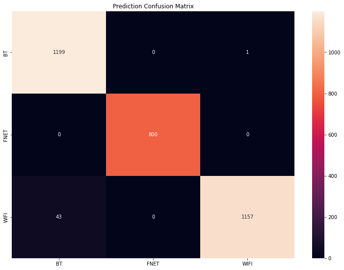
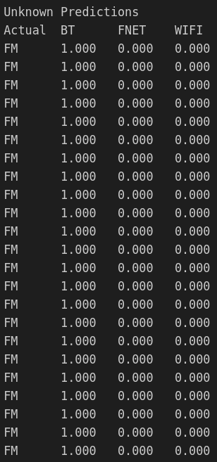

# Classification target removal

> This document contains the observations of model behaviour when certain classes are removed from model training, then run through the model as prediction records

Model was trained as per normal without `LTE` and `FM` records, as these had similar counterparts in the train dataset, namely `WIFI` and `FNET` respectively. The test dataset was also split into 2, one for validation of model performance with known data, which included everything but `LTE` and `FM` records, and another for testing unknown data behaviour, which included only `LTE` and `FM` records.

> As seen in this screenshot, the model is quite performant, albeit with some overfitting of the `WIFI` records.

What we are more interested in, however, is the behaviour of the model for unknown records, whether it will predict them as an existing class or whether it will predict them as not belonging to any class.

> As seen in this screenshot, many of the unknown records are being wrongly classified under an existing class.

The model unfortunately predicts most, if not all the unknown records as part of an existing class, many with high confidences. However, this is expected since it is simply the way most models work in general, and the methods used to allow models to correctly classify unknown targets are still very new and under active development.
